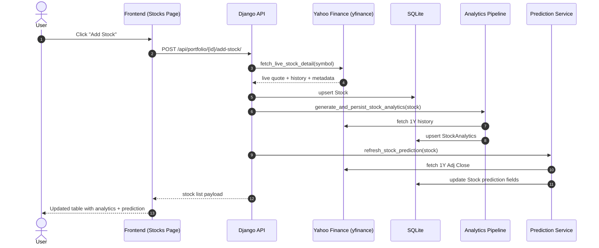
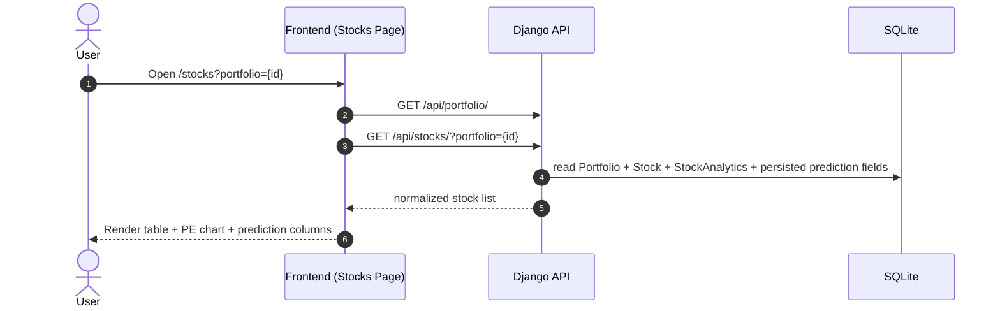
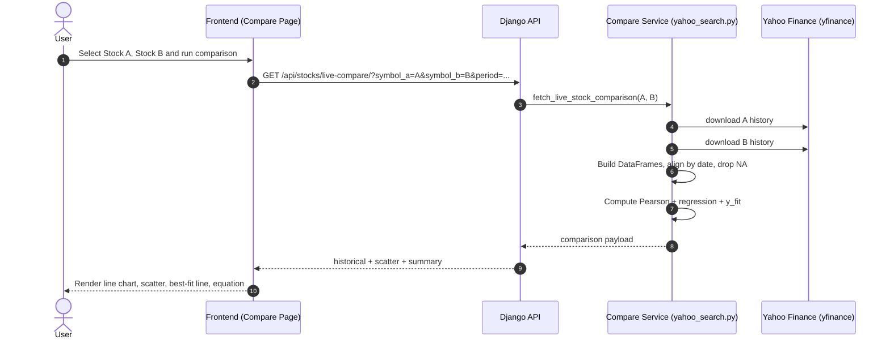
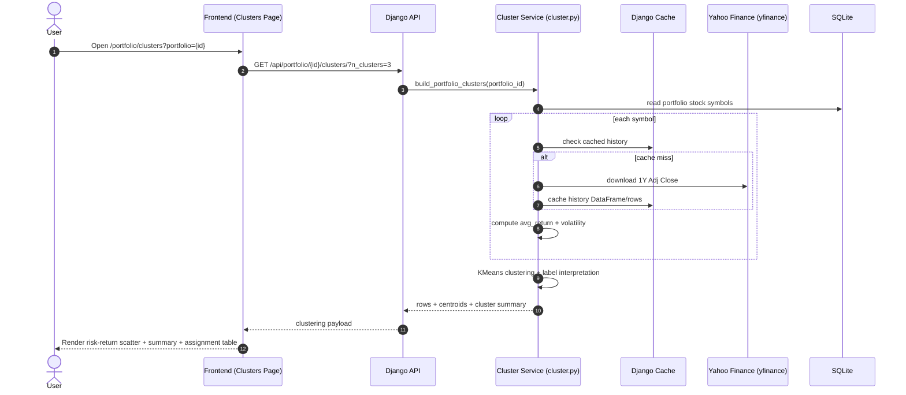
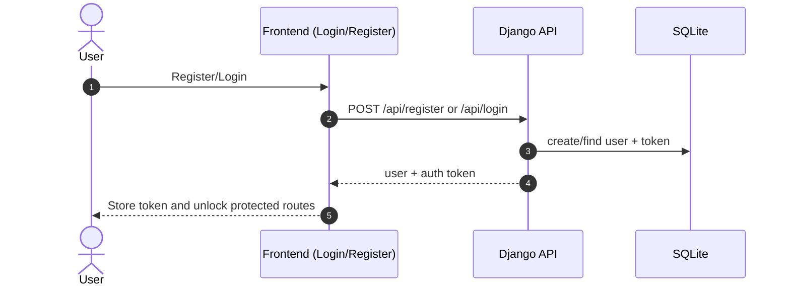

# Sequence Diagrams

## 1. Add Stock + Persist Analytics + Prediction

## 2. Portfolio Stocks Page Load

## 3. Compare Stocks (Live, In-Memory Analysis)

## 4. Portfolio Clustering Analysis

## 5. Authentication Flow

